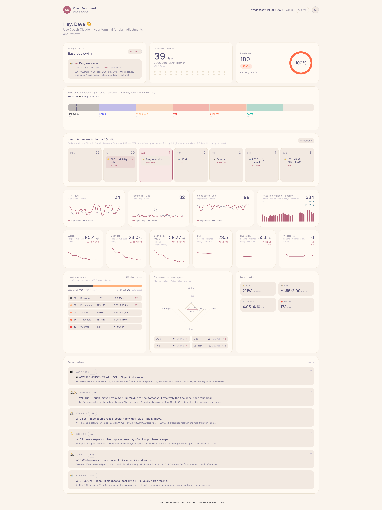

# Claude Coach

**A personal training coach built entirely from files and Claude Code.**

Works for any endurance or fitness pursuit — running, cycling, swimming, triathlon, strength, hybrid. Plans, activity reviews, readiness reads, race strategies — all live as plain markdown in one project folder. Claude reads them, writes them, and coaches from them. An optional Next.js dashboard renders it all.

> Built by [dwedigital](https://github.com/dwedigital) · Uses [Claude Code](https://claude.com/claude-code) · MIT licensed



*Screenshot: one athlete's setup mid-triathlon build. Your dashboard shape depends on what disciplines your profile declares — running, cycling, or a hybrid gives you a different card mix.*

---

## What's in the box

```
claude-coach/
├── coach/            # The coach mechanic — markdown files + scripts
│   ├── CLAUDE.md     # System prompt (discipline-agnostic core)
│   ├── athlete/      # Your profile — modular, keep only the disciplines you train
│   ├── plans/        # Training plans (examples: marathon, cycling fondo, triathlon)
│   ├── goals/        # Event targets
│   ├── playbooks/    # Sport-specific playbooks (running, cycling, triathlon…)
│   ├── log/          # Reviews, readiness reads, source data
│   └── scripts/      # Data pullers (Garmin, Renpho, etc)
│
├── dashboard/        # Optional Next.js dashboard (read-only view)
│
└── docs/             # Quickstart, source adapters, customisation
```

You can use just `coach/` (talk to Claude in your terminal) — the dashboard is optional glasses on top.

---

## Quickstart

Full setup guide: **[docs/QUICKSTART.md](docs/QUICKSTART.md)**

TL;DR:

```bash
# 1. Clone
gh repo clone dwedigital/claude-coach
cd claude-coach

# 2. Bootstrap (copies templates, checks prerequisites — idempotent)
./scripts/setup.sh

# 3. Let the coach set you up
claude
# then type: /onboard — the coach interviews you and writes your
# profile, derives your zones, and builds your first plan

# 4. (Optional) Run the dashboard
./scripts/setup.sh --with-dashboard
cd dashboard && npm run dev
# → http://localhost:3000
```

---

## Data sources

Wire in whichever you have. All are optional.

| Source | What it gives you | Adapter status |
|--------|------------------|----------------|
| **Strava** | Activities, HR streams, laps | ✅ Built-in (MCP fork or REST API) |
| **Garmin Connect** | Recovery, HRV, sleep, training readiness | ✅ Built-in (via `garmin_pull.py`) |
| **Eight Sleep** | Sleep stages, rMSSD HRV, heart rate | ✅ Built-in (MCP or local API) |
| **Renpho scales** | Weight, body fat, muscle mass, visceral fat | ✅ Built-in (unofficial Python API) |
| **Whoop / Oura / Fitbit / Apple Health** | — | Adapter pattern — see [docs/ADDING-SOURCES.md](docs/ADDING-SOURCES.md) |

---

## What makes it different

- **Sport-agnostic core** — the coaching methodology (periodisation, 80/20, RPE, load management) applies to any endurance/fitness pursuit. Discipline-specific playbooks (running, cycling, triathlon…) extend it.
- **Terminal-first coach** — you talk to Claude, it reads/writes markdown, no chat UI. Full audit trail.
- **Files-as-memory** — everything is greppable, git-versionable, portable. No lock-in.
- **Coach voice is customisable** — edit `coach/CLAUDE.md` to change the personality, workflows, rules.
- **Dashboard is optional** — the coach works standalone in a terminal; the dashboard is just a viewer.
- **Extensible** — plug in whatever data source you want by writing a small adapter.

## Example plans included

- **[6-week Super Sprint Triathlon](coach/plans/examples/6-week-super-sprint-triathlon.md)** — multi-sport build off a prior race
- **[12-week Marathon](coach/plans/examples/12-week-marathon.md)** — running periodisation from base to race
- **[8-week Cycling Fondo](coach/plans/examples/8-week-cycling-fondo.md)** — FTP-anchored cycling build

---

## Documentation

- **[docs/QUICKSTART.md](docs/QUICKSTART.md)** — Full setup, step by step
- **[docs/ARCHITECTURE.md](docs/ARCHITECTURE.md)** — How it all fits together
- **[docs/ADDING-SOURCES.md](docs/ADDING-SOURCES.md)** — Wire in a new data source
- **[docs/CUSTOMISING-COACH.md](docs/CUSTOMISING-COACH.md)** — Coach voice, plan format, cards

---

## Security & privacy

Your training data stays local. The `.gitignore` excludes:

- Your actual `athlete/profile.md`, `plans/current-plan.md`, `goals/*.md`
- All contents of `log/` (reviews, readiness, source dumps)
- All `.env*` files
- Any cached auth tokens

**Never commit your personal data.** The template includes strong `.gitignore` rules, but caution when adding new file types.

---

## License

MIT — do whatever you want. Attribution appreciated but not required.

---

## Credits

Built by Dave Edwards ([dwedigital](https://github.com/dwedigital)) as a personal triathlon coach, then generalised into a sport-agnostic template for anyone who wants to try the pattern. Inspired by the "software that keeps working forever" idea — no cloud, no accounts, no lock-in, just files and a good LLM.
